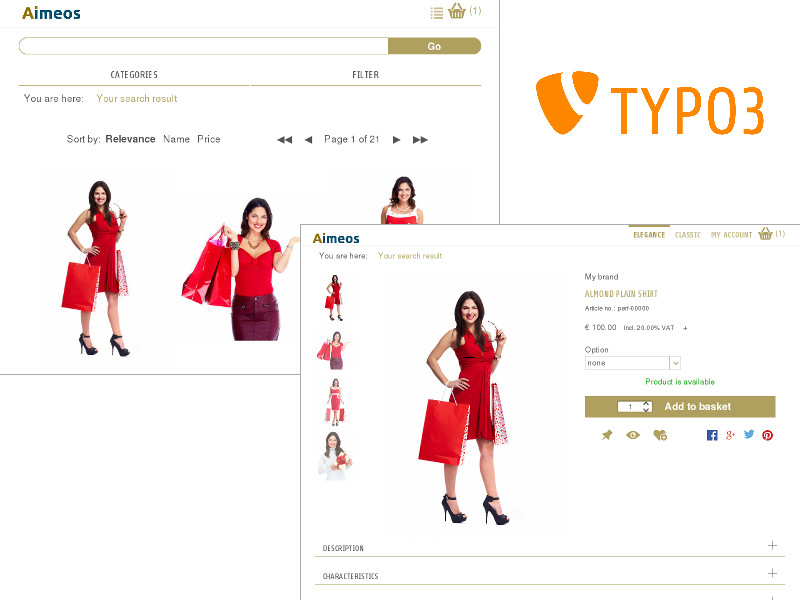

.. ==================================================
.. FOR YOUR INFORMATION
.. --------------------------------------------------
.. -*- coding: utf-8 -*- with BOM.

.. include:: ../Includes.txt

.. _introduction:

Introduction
============

.. _what-it-does:

What does it do?
----------------

The Aimeos web shop distribution is a one click TYPO3 distribution that turns your fresh TYPO3
installation into a powerful and flexible web shop instantly.

The distribution package provides an out of the box web shop based on the the Aimeos
web shop extension for TYPO3. The package contains a pre-configured, full featured shop
including faceted search, product listings and detail views as well as baskets, coupon
handling the checkout process and all e-mail handling for notifying the customers.

.. _screenshots:

Screenshots
-----------

Aimeos web shop distribution

   Aimeos web shop distribution after installation

   How the Aimeos front-end of the Aimeos web shop distribution looks like just after installation
