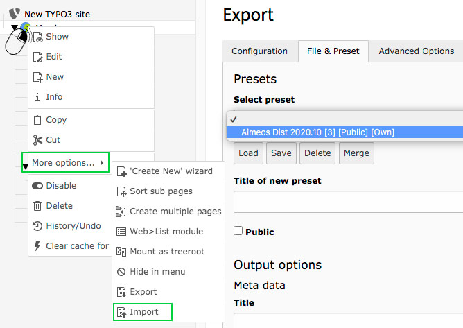

<a href="https://aimeos.org/">
    
</a>

# Aimeos online shop distribution for TYPO3

The distribution package provides an out of the box web shop based on the the Aimeos
online shop extension for TYPO3 v10. The package contains a pre-configured, full featured shop
including faceted search, product listings and detail views as well as baskets, coupons,
handling the checkout process and all e-mail handling for notifying the customers.

**Table of contents**
- [Aimeos online shop distribution for TYPO3](#aimeos-online-shop-distribution-for-typo3)
  - [Installation](#installation)
    - [From TER](#from-ter)
    - [Composer](#composer)
  - [Troubleshooting](#troubleshooting)
  - [Customize your Aimeos distribution](#customize-your-aimeos-distribution)
  - [License](#license)
  - [Links](#links)

## Installation

### From TER

For non-composer installations, you can install the Aimeos distribution using the
Extension manager. You can choose Aimeos from the list of available distributions:


Alternatively, you can download the [Aimeos TYPO3 distribution](https://extensions.typo3.org/extension/aimeos_dist/)
package from the TER and use the Extension Manager to install it manually.

**Important**  
Since the *Aimeos Distribution* needs to find dependencies, make sure to populate/update the 
extension list first, especially when you are starting anew with a completely fresh TYPO3 
installation.

### Composer

To install TYPO3 via composer, execute this at the command line

```bash
composer create-project "typo3/cms-base-distribution:^10.4" myshop
```

to install the required TYPO3 packages. Afterwards, you have to create the
`FIRST_INSTALL` file to be able to run the setup process:

```bash
touch ./public/FIRST_INSTALL
```

For local installations you can fire up the internal PHP web server

```bash
php -S 127.0.0.1:8000 -t public
```

and open the URL ("http://127.0.0.1:8000") in your web browser. If you use Apache or
another web server, head over directly to the URL your installation is reachable directly
without starting the PHP wev server. Complete the TYPO3 setup process before you continue
to install the Aimeos distribution.

Then you need to add this to your `composer.json` file in the root application directory:

```json
    "scripts": {
        "post-install-cmd": [
            "Aimeos\\Aimeos\\Custom\\Composer::install"
        ],
        "post-update-cmd": [
            "Aimeos\\Aimeos\\Custom\\Composer::install"
        ],
        ...
}```

Install the Aimeos distribution for TYPO3 via command line:

```bash
composer req aimeos/aimeos_dist
```

Then activate the extensions and update the database:

```bash
./vendor/bin/typo3 extension:activate scheduler
./vendor/bin/typo3 extension:activate aimeos
./vendor/bin/typo3 extension:activate aimeos_dist
```

Now your Aimeos installation is complete and you can check the frontend and log into
the TYPO3 backend.

## Troubleshooting

- In case there is no page tree, go to the extension manager and un-/reinstall aimeos_dist and aimeos.
- In case there are no products, go to the extension manager and click on the Aimeos update script.
- To check the login functionality, use *12341234* as password or assign a new password to *customer@example.com*!
- If you come from the *aimeos_dist v2019*, please be aware that the previous page *My account* is now called *Profile*. Accordingly, the typoscript constant `tx_aimeos.myaccount.target` has been renamed to `tx_aimeos.profile.target` in *Configuration/TypoScript/constants.txt*.

## Customize your Aimeos distribution

Creating a distribution is all about exporting the proper settings, tables and files. To facilitate
this process, you can import a SQL preset from `Resources/Public/ImportExportPreset.sql` manually
to your MySQL / Maria database (use phpmyadmin or a similar tool, but not TYPO3). Once imported,
you will find a preset option in the *File & Preset* tab of the Import-Export manager. Select and
load it, save it under a new name, then make your changes.



Read more about creating a TYPO3 distribution at the [TYPO3 Documentation](https://docs.typo3.org/m/typo3/reference-coreapi/master/en-us/ExtensionArchitecture/CreateNewDistribution/Index.html).

## License

The Aimeos TYPO3 distribution is licensed under the terms of the GPL Open Source
license and is available for free.

## Links

* [Web site](https://aimeos.org/TYPO3)
* [Help](https://aimeos.org/help)
* [Documentation](https://aimeos.org/docs/typo3/)
* [Issue tracker](https://github.com/aimeos/aimeos-typo3-dist/issues)
* [Source code](https://github.com/aimeos/aimeos-typo3-dist)
